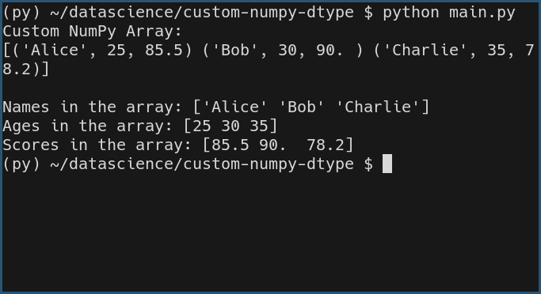

# Creating a Custom NumPy Data Type and Using It in an Array

## Task Description  
This task involves defining a custom data type in NumPy with multiple fields and using it to create a structured array. This is useful for handling tabular data efficiently, similar to a DataFrame.

## Task Output  

## Libraries and Functions Used  
- **NumPy Library**: For numerical computing and efficient array operations.  
- **`np.dtype`**: To define a custom data type with multiple fields.  
- **`np.array`**: To create a structured array with the custom data type.
