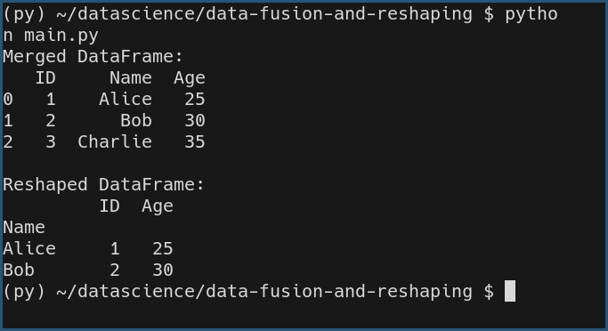

# Data Fusion and Reshaping for Complex Analytical

## Task Description  
This task involves merging two DataFrames based on a common key (`ID`) and reshaping the data into a structured format to create an analytical dataset. The goal is to combine information from multiple sources and present it in a more meaningful way.

## Task Output  

## Libraries and Functions Used  
- **Pandas Library**: For data manipulation and analysis.  
- **`pd.DataFrame`**: To create DataFrames.  
- **`pd.merge`**: To merge DataFrames using a common column.  
- **`set_index`**: To reshape the data for better structure and indexing.
