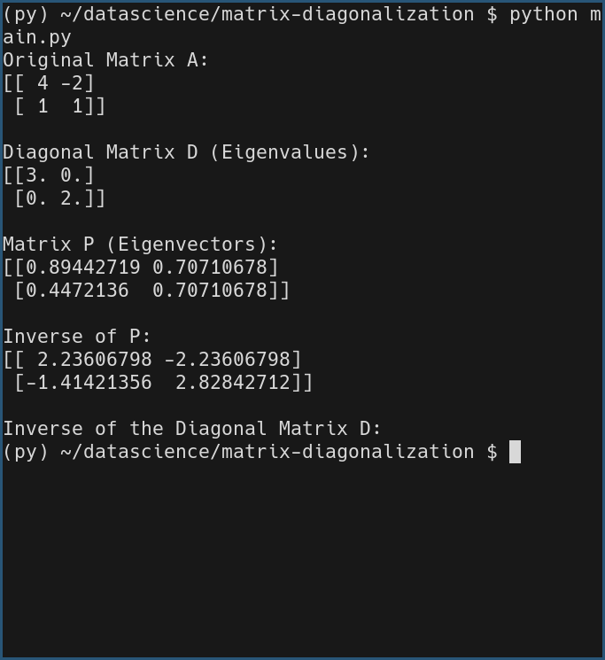

# Matrix Diagonalization and Inverse Diagonal Matrix Computation

## Task Description
In this task, we perform matrix diagonalization on a given matrix \( A \). Additionally, we compute the inverse of the diagonal matrix \( D \), which is simply another diagonal matrix where each diagonal element is the reciprocal of the corresponding eigenvalue.

## Task Output
The output includes:
1. The original matrix \( A \),
2. The diagonal matrix \( D \) (containing the eigenvalues),
3. The matrix \( P \) (containing the eigenvectors),
4. The inverse of matrix \( P \),
5. The inverse of the diagonal matrix \( D \).

## Libraries and Functions Used:
- **NumPy**: For matrix computations.
  - **`np.linalg.eig()`**: Computes the eigenvalues and eigenvectors of a matrix.
  - **`np.diag()`**: Converts an array of eigenvalues into a diagonal matrix.
  - **`np.linalg.inv()`**: Computes the inverse of a matrix.
