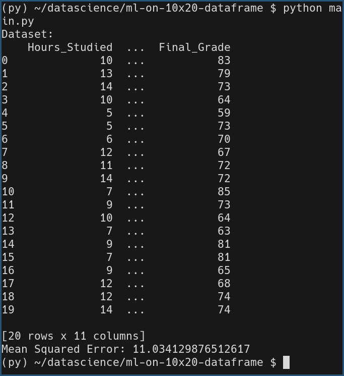

# Analyzing a 10x20 Student Performance DataFrame with Machine Learning

## Task Description
In this task, I created a 10x20 DataFrame containing features related to student performance, such as the number of hours studied, class attendance, and quiz scores. The target variable is the **Final Grade** of the student. I then applied a **linear regression model** to predict the **Final Grade** based on these features.

## Dataset Features:
1. **Hours_Studied**: Number of hours a student studied.
2. **Attendance**: Percentage of classes attended.
3. **Assignments_Completed**: Number of assignments completed.
4. **Quiz_Score**: Average score on quizzes.
5. **Participation**: Class participation percentage.
6. **Previous_Grade**: Grade from the previous exam.
7. **Extra_Activities**: Hours spent on extracurricular activities.
8. **Sleep_Hours**: Average daily sleep hours.
9. **Stress_Level**: Stress level on a scale of 1 to 10.
10. **Internet_Usage**: Daily internet usage in hours.

## Task Output
The model predicts the **Final Grade** based on the given features. The output includes the dataset, as well as the **Mean Squared Error (MSE)** for evaluating model accuracy.

## Libraries and Functions Used:

- **Pandas**: For creating and handling the DataFrame.
  - **`pd.DataFrame()`**: Converts a Python dictionary into a DataFrame (2D table). This is used to structure the data with features and the target variable.

- **NumPy**: For generating random data and performing numerical operations.
  - **`np.random.seed()`**: Sets the seed for random number generation to ensure reproducibility. This ensures the random numbers generated are the same each time the program runs.
  - **`np.random.randint()`**: Generates random integers within a specified range. Used to generate integer values for features like `Hours_Studied`, `Attendance`, etc.
  - **`np.random.uniform()`**: Generates random float values within a specified range. Used for features like `Sleep_Hours` and `Internet_Usage`, which require continuous values.
  - **`np.random.normal()`**: Adds normally distributed random noise to the data (used to create variability in the target variable `Final_Grade`).

- **Scikit-learn**: For applying the machine learning model and evaluating it.
  - **`train_test_split()`**: Splits the data into training and testing sets. It randomly divides the data into two subsets, where the training set is used to train the model, and the testing set is used to evaluate the model's performance.
    - **Parameters**:
      - `X`: The input features (independent variables).
      - `y`: The target variable (dependent variable).
      - `test_size`: Specifies the proportion of the data to include in the test set. Here, 0.2 means 20% of the data is used for testing.
      - `random_state`: Ensures the split is reproducible.

  - **`LinearRegression()`**: Initializes the linear regression model. This model is used to learn the relationship between input features and the target variable (`Final_Grade`).
    - **Methods**:
      - **`fit(X_train, y_train)`**: Trains the model using the training data. The model learns the coefficients for each feature and the intercept.
      - **`predict(X_test)`**: Makes predictions using the trained model on the test set `X_test`.

  - **`mean_squared_error()`**: Calculates the Mean Squared Error (MSE) between the true values (`y_test`) and the predicted values (`y_pred`). It’s a common evaluation metric for regression models that measures the average of the squared differences between the predicted and actual values.

## Model Details:
- **Model Type**: Linear Regression
- **Target Variable**: Final Grade
- **Features**: Hours Studied, Attendance, Assignments Completed, Quiz Score, Participation, Previous Grade, Extra Activities, Sleep Hours, Stress Level, Internet Usage
- **Evaluation Metric**: Mean Squared Error (MSE)

