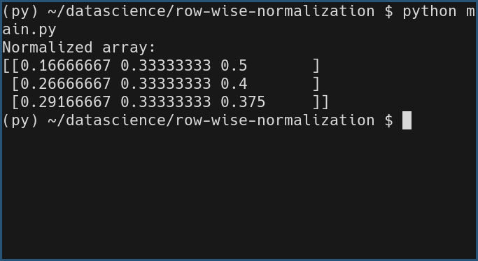

# Row-wise Normalization of a 2D NumPy Array

## Task Description

This task is about normalizing each row of a 2D NumPy array so that the sum of elements in each row equals 1.

## Task Output

## Libraries and Functions Used

- **NumPy Library**: Used for efficient array operations in Python.

  - **`np.array`**: To create a 2D array.
  - **`sum(axis=1, keepdims=True)`**: To calculate the sum of each row.
  - **Broadcasting**: To divide each element by its row sum automatically.
